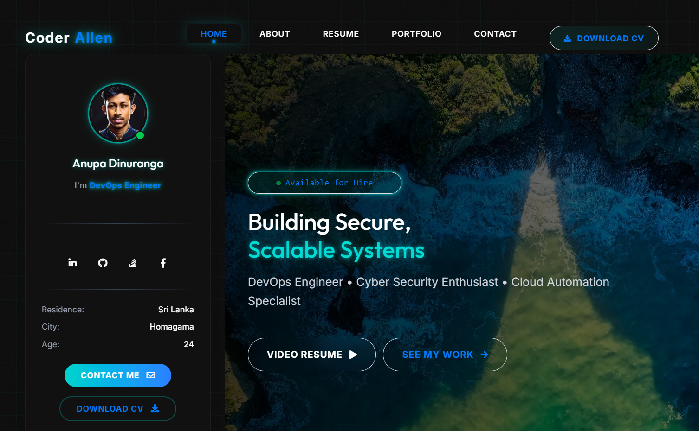

<div align="center">

# �� Portfolio V3

### Modern Portfolio Website Built with Next.js 16 & TypeScript

A stunning, production-ready portfolio featuring glass morphism design, interactive animations, and cutting-edge web technologies.

[](https://nextjs.org/)
[](https://www.typescriptlang.org/)
[](https://tailwindcss.com/)
[](https://react.dev/)
[](./LICENSE)

[Live Demo](https://www.anupa.live) • [Report Bug](https://github.com/AnuV6/portfolio-v3/issues) • [Request Feature](https://github.com/AnuV6/portfolio-v3/issues)

</div>

---

## í³¸ Preview

<!-- Replace 'preview.png' with your actual screenshot -->
<div align="center">
  
  <p><em>Screenshot of Portfolio V3 - Add your actual preview image to <code>public/img/preview.png</code></em></p>
</div>

---

## ✨ Features

<table>
<tr>
<td>

### í¾¨ Design & UX
- **Glass Morphism UI** with neon cyan accents
- **Smooth Animations** powered by Locomotive Scroll
- **Interactive Spotlight Cards** with mouse tracking
- **Fully Responsive** mobile-first design
- **Dark Theme** optimized for modern aesthetics

</td>
<td>

### âš¡ Performance & Tech
- **Next.js 16** with Turbopack for blazing fast builds
- **TypeScript** for type safety and reliability
- **Tailwind CSS v4** for efficient styling
- **Optimized Images** with WebP/AVIF formats
- **Lazy Loading** for optimal performance

</td>
</tr>
<tr>
<td>

### í¾­ Interactive Components
- Mouse-tracking spotlight effects
- Animated statistics counters
- Dynamic project carousel with Swiper
- Lightbox gallery with Fancybox
- Smooth scroll navigation

</td>
<td>

### ♿ Accessibility & SEO
- **ARIA labels** throughout
- **Semantic HTML5** structure
- **Keyboard navigation** support
- **SEO optimized** meta tags
- **Fast loading** with code splitting

</td>
</tr>
</table>

---

## í» ï¸� Tech Stack

### Core Technologies
```
Frontend Framework    → Next.js 16.0.7 (App Router)
Programming Language  → TypeScript 5.9.3
UI Library           → React 19.2.1
Styling              → Tailwind CSS 4.1.18
Build Tool           → Turbopack
```

### Key Dependencies
| Library | Version | Purpose |
|---------|---------|---------|
| Locomotive Scroll | 4.1.4 | Smooth scroll animations |
| Swiper | 11.1.4 | Touch-enabled carousels |
| Fancybox | 5.0.33 | Lightbox image gallery |
| EmailJS | 3.12.1 | Contact form integration |
| React Toastify | 10.0.6 | Toast notifications |
| Font Awesome | Latest | Icon library |

---

## í³¦ Getting Started

### Prerequisites

- **Node.js** 18.0 or higher
- **npm** or **yarn** package manager
- **Git** for version control

### Installation

1. **Clone the repository**
   ```bash
   git clone https://github.com/AnuV6/portfolio-v3.git
   cd portfolio-v3
   ```

2. **Install dependencies**
   ```bash
   npm install
   # or
   yarn install
   ```

3. **Set up environment variables** (Optional - for EmailJS)
   ```bash
   cp .env.example .env.local
   ```
   
   Then edit `.env.local`:
   ```env
   NEXT_PUBLIC_EMAILJS_SERVICE_ID=your_service_id
   NEXT_PUBLIC_EMAILJS_TEMPLATE_ID=your_template_id
   NEXT_PUBLIC_EMAILJS_PUBLIC_KEY=your_public_key
   ```

4. **Run development server**
   ```bash
   npm run dev
   ```
   
   Open [http://localhost:3000](http://localhost:3000) in your browser íº€

---

## í¿—ï¸� Build & Deployment

### Production Build
```bash
npm run build    # Build for production
npm run start    # Start production server
```

### Static Export
```bash
npm run build
npm run export   # Export to static HTML
```

### Deploy to Vercel (Recommended)

[](https://vercel.com/new/clone?repository-url=https://github.com/AnuV6/portfolio-v3)

**Or using Vercel CLI:**
```bash
npm install -g vercel
vercel --prod
```

### Other Platforms
- **Netlify**: Connect your GitHub repo and deploy
- **AWS Amplify**: Use the AWS Amplify Console
- **Custom VPS**: Build and serve with Node.js

---

## � Project Structure

```
portfolio-v3/
├── í³‚ app/                          # Next.js App Router
│   ├── globals.css                 # Global styles & animations
│   ├── layout.tsx                  # Root layout component
│   ├── loading.tsx                 # Loading UI
│   └── page.tsx                    # Home page
│
├── í³‚ components/                   # React components
│   ├── ScrollToTopButton.tsx       # Scroll to top button
│   ├── ProfileSidebar.tsx          # Profile card with avatar
│   ├── NavigationBar.tsx           # Fixed navigation header
│   ├── HeroBanner.tsx              # Hero section with carousel
│   ├── AboutSection.tsx            # About me section
│   ├── Skills.tsx                  # Skills showcase grid
│   ├── SkillBadges.tsx             # Skill badges display
│   ├── Portfolio.tsx               # Projects portfolio
│   ├── ExperienceTimeline.tsx      # Work & education timeline
│   ├── Achievements.tsx            # Certifications carousel
│   ├── StatsCounter.tsx            # Animated statistics
│   ├── Contact.tsx                 # Contact form
│   ├── SpotlightCard.tsx           # Interactive card wrapper
│   ├── Skeleton.tsx                # Loading skeletons
│   └── ...
│
├── í³‚ context/                      # React Context API
│   └── context.tsx                 # Global state management
│
├── í³‚ layout/                       # Layout components
│   └── TrueManLayout.tsx           # Main layout wrapper
│
├── í³‚ public/                       # Static assets
│   ├── img/                        # Images & icons
│   ├── files/                      # Documents (CV, etc.)
│   └── css/                        # CSS plugins
│
├── í³‚ utility/                      # Helper functions
│   ├── index.ts                    # Utility functions
│   ├── sliderProps.ts              # Swiper configurations
│   └── typing.ts                   # Typing animation
│
├── .env.example                    # Environment variables template
├── .gitignore                      # Git ignore rules
├── LICENSE                         # MIT License
├── README.md                       # Documentation
├── next.config.mjs                 # Next.js configuration
├── tailwind.config.ts              # Tailwind configuration
├── tsconfig.json                   # TypeScript configuration
└── package.json                    # Project dependencies
```

---

## í¾¨ Customization Guide

### Update Personal Information

1. **Profile & Bio**
   - Edit `context/context.tsx` for personal data
   - Update social media links and contact info

2. **Images**
   - Replace `public/img/avatar.avif` with your photo
   - Update banner images in `public/img/banner*.webp`
   - Add your project screenshots to `public/img/portfolio/`

3. **Resume/CV**
   - Replace `public/files/AnupaDinuranga_cv.pdf` with your CV

4. **Projects**
   - Edit portfolio items in `components/Portfolio.tsx`
   - Update project images and descriptions

5. **Skills**
   - Modify skill lists in `components/Skills.tsx`
   - Update skill icons in `public/img/icons/`

### Styling

- **Theme Colors**: Edit CSS variables in `app/globals.css`
- **Primary Color**: Default is `#00d4cc` (neon cyan)
- **Fonts**: Update font imports in `app/layout.tsx`
- **Animations**: Adjust durations in component styles

---

## í³Š Performance Metrics

```
✓ Lighthouse Score         95+/100
✓ First Contentful Paint   < 1.5s
✓ Time to Interactive      < 3.0s
✓ Total Bundle Size        Optimized with code splitting
✓ Mobile Performance       95+/100
```

---

## í°› Known Issues & Solutions

| Issue | Solution |
|-------|----------|
| Locomotive Scroll lag on mobile | Automatically disabled on touch devices |
| Large image file sizes | Use WebP/AVIF formats with next/image optimization |
| EmailJS CORS errors | Ensure public key is correctly set in .env.local |

---

## í´� Contributing

Contributions are welcome! Here's how you can help:

1. Fork the repository
2. Create a feature branch (`git checkout -b feature/AmazingFeature`)
3. Commit your changes (`git commit -m 'Add some AmazingFeature'`)
4. Push to the branch (`git push origin feature/AmazingFeature`)
5. Open a Pull Request

---

## í³„ License

This project is licensed under the **MIT License** - see the [LICENSE](LICENSE) file for details.

You are free to use this project for personal or commercial purposes.

---

## í±¨â€��� Author

<div align="center">

### Anupa Dinuranga

**DevOps Engineer • Cyber Security Enthusiast • Cloud Automation Specialist**

[](https://github.com/AnuV6)
[](https://www.anupa.live)
[](https://linkedin.com/in/anupa-dinuranga)

</div>

---

## � Acknowledgments

- [Next.js](https://nextjs.org/) - The React Framework for Production
- [Tailwind CSS](https://tailwindcss.com/) - A utility-first CSS framework
- [Vercel](https://vercel.com/) - Deployment and hosting platform
- [Font Awesome](https://fontawesome.com/) - Icon library
- All the amazing open-source contributors

---

## í´„ Version History

### v3.0.0 (December 24, 2025)
- ✨ Complete codebase refactor with semantic component naming
- âš¡ Updated to Next.js 16 with Turbopack
- í¾¨ Integrated Tailwind CSS v4
- ♿ Enhanced accessibility with ARIA labels
- í³ˆ Improved performance and SEO
- í³š Comprehensive documentation
- íº€ Production-ready build

---

<div align="center">

### â­� Star this repo if you find it helpful!

**Built with �� using Next.js, TypeScript, and Tailwind CSS**

[⬆ Back to Top](#-portfolio-v3)

</div>
